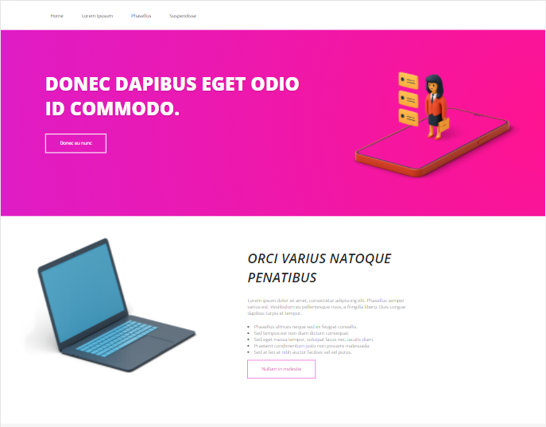

# 👩‍💻Projeto-Minery

Este projeto é teste de Front-end proposta pela empresa Minery.

## 📄 O Desafio

O objetivo deste teste é criar uma página web baseado no protótipo de alta fidelidade proposto pela empresa utilizando HTML e CSS.

## 🚀 Tecnologias
- HTML
- CSS